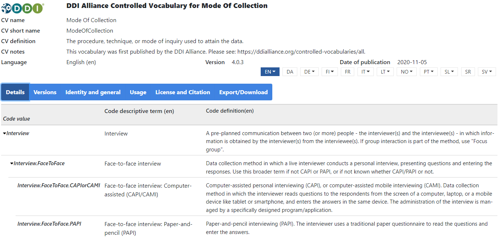
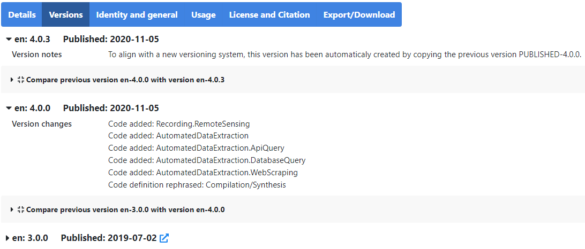

# {{ page.title }}

Vocabulary level information includes:

- CV name: the human readable vocabulary title
- CV short name: identifier for the vocabulary that remains the same across languages
- CV definition: definition and purpose of the vocabulary
- CV notes: additional information relating to the vocabulary
- Languages in which the CV is available

Code level information includes:

- Code value that remains the same across languages, identifying the code/concept
- Descriptive terms for each code
- Definition for each code, specifying the meaning and scope of the concept

Code values and descriptive terms are mandatory in the system, definitions are optional.

The ‘Versions’ section gives information on what has been changed since the last version in that language,
with a comparison table between the current and the previous version displaying the differences.
There are also links to the previously published versions.
Note that some vocabularies do not have version information for versions published in a previous vocabulary platform.

The ‘Identity and general’ section provides the vocabulary [URI](https://en.wikipedia.org/wiki/Uniform_Resource_Identifier)
as well as information on the creating agency and translating agency, with links to these organisations.

The ‘Usage’ section generally provides information on the DDI elements for which the vocabulary can be used.
Licence and citation information is provided in its own section.
