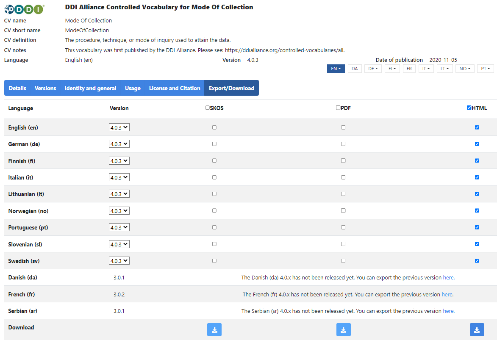

# {{ page.title }}

Click on the ‘Export/download’ tab in either the results list or in the detailed vocabulary view to get to the download table.
In the table, you can choose the download format (SKOS, PDF or HTML) and which languages to include in the download.
If you want all languages, check the box beside SKOS, PDF or HTML on the top row.
To empty your choice, recheck the box.

After choosing your format and languages, click on the relevant download button on the bottom row.

Note that the table allows you to download only those language versions that have been updated
to the current source vocabulary version.
Older versions can be downloaded from the webpage of the older version.
The download table contains the links to the older version.

The service also provides [REST APIs](https://api.tech.cessda.eu/).
