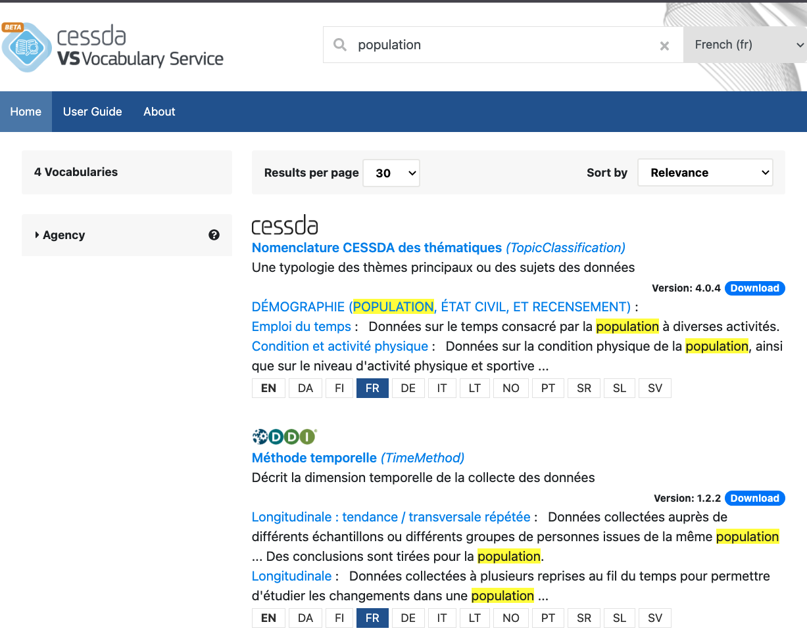

# {{ page.title }}

Use the search box to look for words in CV or short names, CV definitions or notes,
code values, descriptive terms or definitions.
To get optimal results, choose a language from the drop-down list next to the search box,
particularly if you want to search content that differs between languages.
You can also choose ‘All languages’ but in that case it is likely that the search will not find all
the different forms of your search terms (singular/plural/other cases) in all languages.

The system highlights the search term in the results list.

You can restrict your search to vocabularies from a particular agency by using the filter ‘Agency’.
Note that this filter covers the agencies providing original source vocabularies,
not the agencies providing translations.

If you want to see what vocabularies are available in a particular language,
choose the language from the dropdown list next to the search box.
The system gives a list of vocabularies in that language.

The results list shows a list of languages in which a particular vocabulary is available.
You can switch between the languages by clicking on the language code in the box.
Clicking on the ‘Download’ button in the results list will bring you to the download table
where you can select the format and languages to include.

It is possible to sort the results by relevance or by the vocabulary name (A-Z, Z-A).
