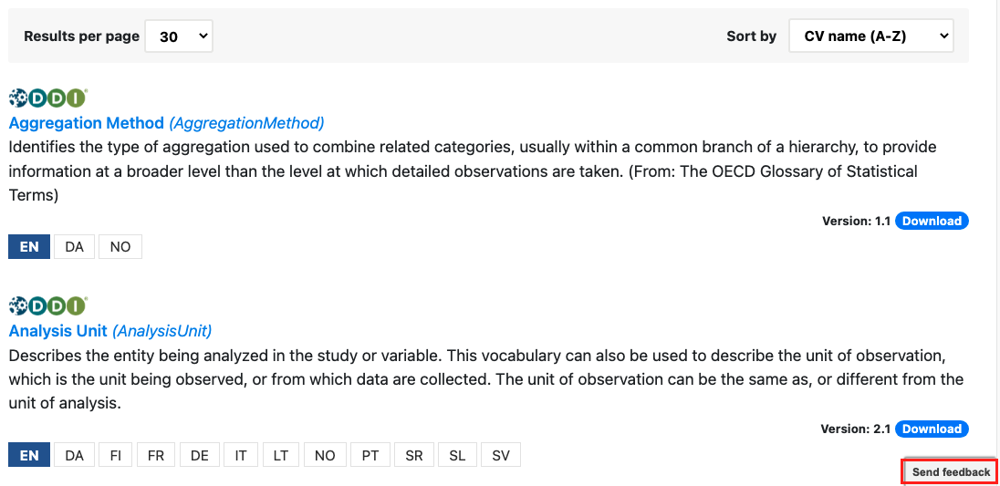
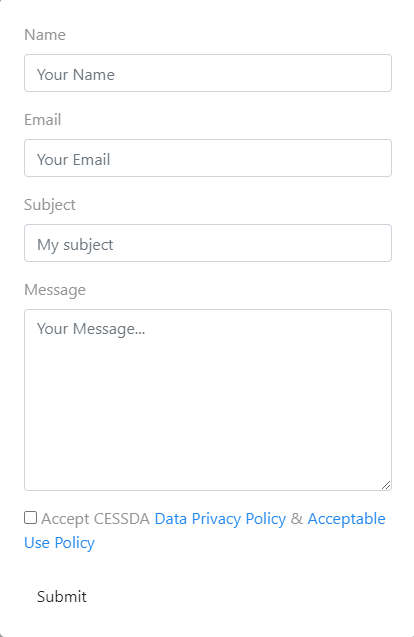

# {{ page.title }}

If you encounter any problems with the service, you can report them by clicking on the ‘Send feedback’
button at bottom right (highlighted in red) and filling in the online form.

Feel free to provide any kind of feedback, insight or suggestions for the CESSDA Vocabulary Service.
Did you meet any challenges when using the system, what works, what does not work, what can we do better?
Whatever it is you want to say, we will want to hear it.

Give a short summary and describe your issue, choose whether it is a bug,
improvement or new feature in the ‘Components’ field, enter your details and submit.
We will get back to you.
